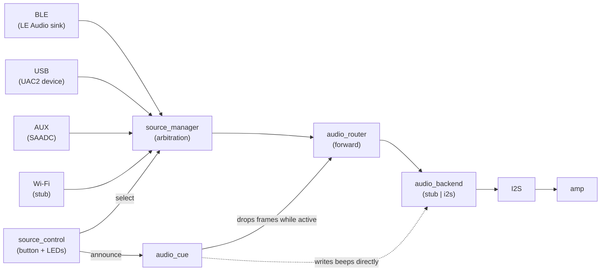

# haiku-runner

A Zephyr-based multi-input speaker for the `nrf5340dk/nrf5340/cpuapp`: LE Audio (BLE), USB Audio
Class 2, and analog AUX inputs feed a shared, source-agnostic pipeline out to an I2S amplifier.

USB audio is verified working end to end (enumerates as a USB sound card, audible from a MAX98357A
amp). LE Audio is complete on the device side but has never streamed for want of a capable source.
AUX captures real samples but needs an external analog front-end. See
[Project Status](docs-site/content/status.md) for the full picture.

## Architecture



BLE is deliberately *not* privileged: it is one input adapter among several behind a common
`audio_input_ops` contract, and the arbitration and output layers know nothing about it. See
[Architecture](docs-site/content/architecture.md) for the full write-up.

## Current scope

- LE Audio (BAP) unicast sink — spec-complete (PACS/ASCS/CAS/VCS/TMAS), unproven end to end for
  want of an LE Audio-capable source
- USB Audio Class 2 input — verified end to end
- AUX jack analog input (SAADC) — capture verified, needs an external front-end for audio
- Source manager with hybrid switching policy (manual selection + auto fallback)
- Hardware-agnostic output backend API (stub, or real I2S to e.g. a MAX98357A)
- Front-panel button + LEDs + audible source-change cue
- Wi-Fi input adapter stub (the nRF5340 has no Wi-Fi radio; needs an nRF7002 companion)
- Optional SOF adapter seam (not required, not implemented)

See [Roadmap](docs-site/content/roadmap.md) for pending work and
[Known Issues](docs-site/content/known-issues.md) for defects and hardware limits.

## Repository layout

- `app/` — Zephyr app
  - `app/configs/` — Kconfig fragments for each hardware combination CI builds (see below)
- `docs-site/` — shadcn-docs-nuxt documentation site
- `.github/workflows/` — CI build matrix

## Quick start

1. Install Zephyr SDK + `west` prerequisites.
2. Initialize workspace from this repo root:
   - `west init -l .`
   - `west update`
3. Build:
   - `west build -b nrf5340dk/nrf5340/cpuapp app --sysbuild`

`--sysbuild` is required: the BLE input (on by default) needs a second image built for the
nRF5340's network core alongside the application image.

CI (`.github/workflows/build.yml`) builds seven configurations on every push — the default plus
one fragment from `app/configs/` per hardware combination (I2S+BLE, I2S+USB, I2S+AUX, all three
inputs together, the USB mock feeder, and the I2S self-test tone) — so a break in any input or
backend path fails CI instead of hiding behind the default's silent stub backend. Build one
directly with:

```bash
west build -b nrf5340dk/nrf5340/cpuapp app --sysbuild -- -Dapp_EXTRA_CONF_FILE=configs/i2s-ble.conf
```

See `docs-site/content/build.md` for full build details and the complete fragment list.
See `docs-site/content/test-hardware/index.md` for test bench documentation.
See `docs-site/content/test-hardware/max98357a-wiring.md` for MAX98357A I2S amp board-to-module wiring.

## Documentation site (shadcn-docs-nuxt)

```bash
cd docs-site
npm install
npm run dev
```

This serves docs locally (default: `http://localhost:3000`) using `shadcn-docs-nuxt`.

## License

Licensed under the Apache License, Version 2.0. See `LICENSE`.
