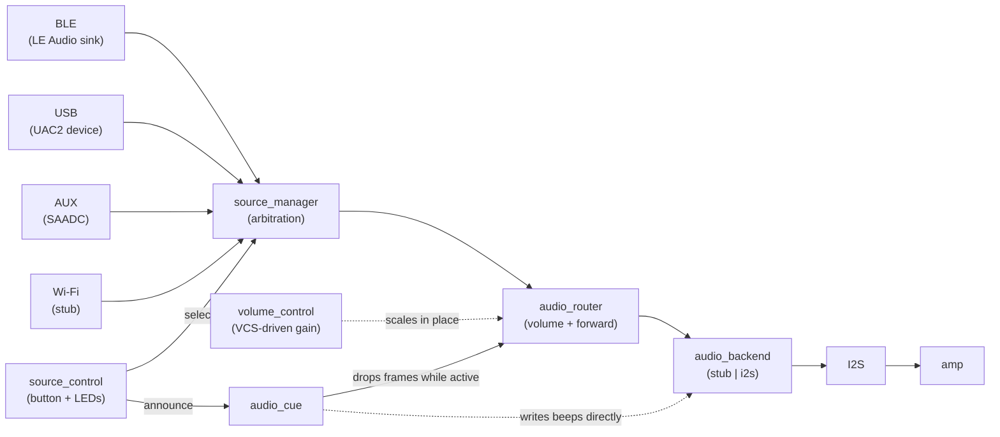

`haiku-runner` is organized around a source-agnostic audio pipeline. BLE is deliberately *not* privileged: it is one input adapter among several, and the arbitration and output layers know nothing about it.

1. **Input adapters** produce `audio_frame` packets and hand them to `input_frame_ingress`.
2. **`source_manager`** decides which single input is live and drops frames from the others.
3. **`audio_router`** applies the current digital volume, then forwards accepted frames to the backend.
4. **`audio_backend`** drives physical output — the stub (silent) or real I2S.

## Layers in detail

### Input adapters

Each implements `struct audio_input_ops` (`init`/`start`/`stop`/`poll`/`healthy`/`set_frame_callback`) and registers itself at boot from `main.c::register_enabled_inputs()`, gated by its `CONFIG_HR_INPUT_*` flag.

They all deliver audio through the same helper, `input_frame_ingress_deliver()`, which validates the chunk and attaches format metadata (rate, channels, bit depth). That shared path is why the backend can treat every source identically.

- **BLE** (`le_audio_sink.c` → `le_audio_bap_sink.c`) — a Bluetooth LE Audio unicast sink. The adapter is a thin shim; the second file owns advertising, PACS/ASCS/CAS/VCS/TMAS registration, the ISO stream and LC3 decode.
- **USB** (`input_usb_uac.c` → `input_usb_uac2.c`) — a USB Audio Class 2 playback device. Received PCM is re-chunked to a stable frame size before delivery, so the backend is not forced to reconfigure per USB frame.
- **AUX** (`input_aux_jack.c`) — SAADC capture with ping-pong buffers, converting single-ended ADC counts to signed PCM.
- **Wi-Fi** (`input_wifi_stream.c`) — a stub; the nRF5340 has no Wi-Fi radio.

### Source arbitration

`source_manager` holds a `source_policy`: a preferred input, a mode, and whether automatic fallback is allowed. On each tick it polls the adapters, then prefers the selected source when healthy, keeps the current one while it stays healthy, and otherwise falls back to any healthy source. "Healthy" is adapter-defined and meaningful — a live BLE stream, an enabled USB terminal, an AUX input above the silence threshold.

`source_manager_on_frame()` discards frames from any source that is not active, which is what allows several inputs to be compiled in and running simultaneously without contending for the output.

### Volume control

`volume_control` is a single digital gain stage applied in `audio_router_submit()`, ahead of every source rather than per-adapter, so one setting covers whichever input is active. It exists because the MAX98357A has fixed analog gain — "volume" can only ever mean scaling the PCM.

Its scale matches the Bluetooth VCS `Volume_Setting` field (0 silent, 255 unity), because the BLE input's VCP Volume Renderer (`vcs_state_cb` in `le_audio_bap_sink.c`) is currently its only real-world driver: a phone's volume slider writes VCS state, and that callback now calls `volume_control_set()`/`volume_control_set_mute()` instead of only logging. USB and AUX have no volume source of their own, so they play at whatever `volume_control` is currently set to — full scale until a BLE client changes it.

`audio_cue` bypasses this entirely, writing straight to `audio_backend` at its own fixed amplitude, so the source-change announcement stays audible however the user's volume is set.

### Output backend

One backend is compiled in, chosen by `CONFIG_HR_BACKEND_I2S`. The I2S backend configures the peripheral **lazily and per format**: the rate and block size come from the frames themselves, so it reconfigures when the active source changes. It also detects and resets a stalled transmitter, which is necessary because a paused stream leaves the DMA in an error state it will not exit on its own.

### Front-panel control

`source_control` cycles the active input on a button press, lights one LED per source, and asks `audio_cue` to announce the change. It runs on its own thread because the announcement sleeps for the length of the cue; doing that on the system workqueue would stall Bluetooth and USB work items.

`audio_cue` writes beeps **straight to the backend**, bypassing `source_manager` so the announcement is heard whichever input is active — including none. `audio_router` drops input frames while a cue sounds so live audio doesn't mix into it.

## Design decisions worth knowing

**Frames carry their own format.** Rate, channel count and bit depth travel with each `audio_frame` rather than being global, which is what lets a 48 kHz USB stream and a 47619 Hz AUX capture coexist in one build.

**The pipeline is synchronous.** A frame is delivered from the producing context (BT RX thread, USB thread, AUX thread) all the way to `i2s_write`. Simple and low-latency, but it means the backend must never block for long — hence non-blocking block allocation and dropping under backpressure rather than stalling the caller.

**Mono is the native shape.** The MAX98357A is a mono amplifier, so the backend duplicates mono into both I2S slots and passes stereo through unchanged.

**BLE requires a second firmware image.** On the nRF5340 the Bluetooth controller lives on the network core; `app/Kconfig.sysbuild` and `app/sysbuild.cmake` build Zephyr's `hci_ipc` for it alongside the application image.

## Where to look next

- [Project Status](/status) — what is actually verified on hardware, and what is not
- [Known Issues](/known-issues) — defects, hardware limits and shortcomings
- [Roadmap](/roadmap) — pending work
- [Input Model](/input-model) — the adapter contract and arbitration rules
- [SOF Integration](/sof-integration) — the optional pipeline seam
