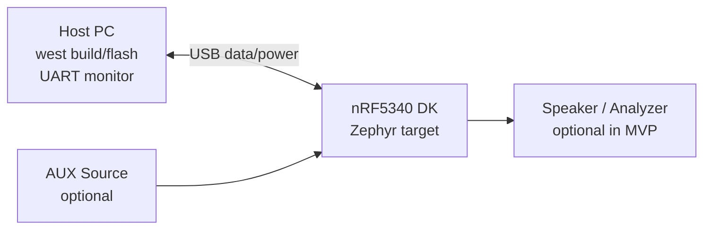

## 1) Bench topology

Use this layout as the default test topology for repeatable manual validation.



```text
+-----------------------+      USB      +----------------------+
| Host PC (Linux/macOS) | <-----------> | nRF5340 DK (target)  |
| - west build/flash    |               | - Zephyr app         |
| - UART terminal       |               | - logging / routing  |
+-----------------------+               +----------+-----------+
                                                    |
                                                    | Audio out (future backend)
                                                    v
                                           +----------------------+
                                           | Speaker / Analyzer   |
                                           | (optional in MVP)    |
                                           +----------------------+
```

## 1.1) Connection map

- Host PC USB port ↔ nRF5340 DK debug USB port
- AUX source 3.5 mm out → board AUX input path (when AUX scenario is enabled)
- Optional monitor output connected only when validating audible output

## 2) Recommended desk placement

- Keep the `nRF5340 DK` centered and reachable.
- Place host PC terminal and serial monitor side-by-side on one screen.
- Route USB cable away from analog AUX cable paths.
- Label each cable endpoint to avoid swap mistakes during rapid retest.

## 3) Input-path-focused variants

### Variant A: Hardware-minimal (fast iteration)

- USB only (power + flash + logs)
- Enable USB-C mock feeder config for synthetic audio frames
- No external audio peripherals required

### Variant B: AUX validation

- USB for flash/logs
- AUX source connected to input adapter path under test
- Optional headphone/scope at output side for signal sanity checks

### Variant C: Mixed switching behavior

- Keep mock USB-C feeder enabled
- Attach AUX source
- Exercise source policy fallback and manual override behavior

## 4) Serial/logging layout

- Open one terminal for build/flash commands
- Open one terminal for runtime logs from the board UART
- Save logs per run with timestamped filenames for regression comparisons
